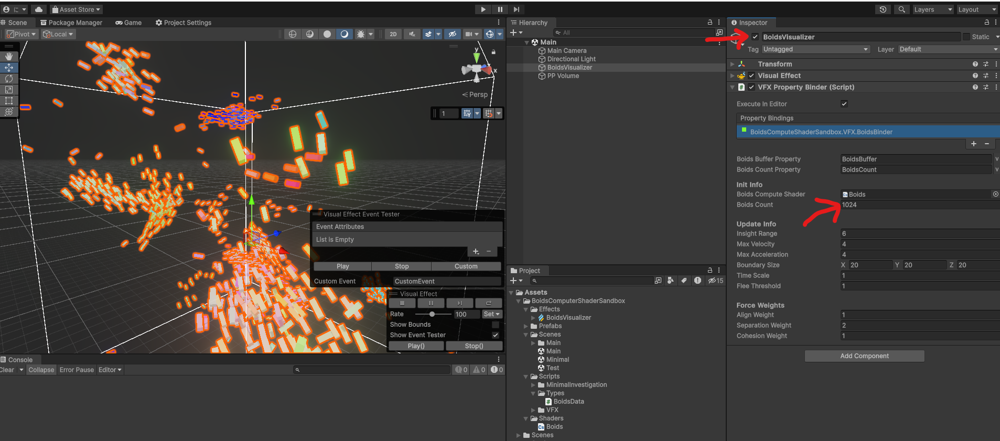

# Boids Unity Compute Shader Sandbox

https://github.com/drumath2237/Boids-Unity-ComputeShader-Sandbox/assets/11372210/3efabf57-5215-4378-bd9f-0d80f6ffc6c2

## About

Boids simulation implemented with Compute Shader and VFX Graph.

## Environment

- Windows 10 Home
- Unity 2023.2.9f1
- URP 16.0.5
- Visual Effect Graph

## Usage

Open the scene in `Assets\BoidsComputerShaderSandbox\Scenes\Main.unity`.

You can set boids entity count by changing number in the inspector of `BoidsVisualizer`.
**Note that, you should re-enable the BoidsVisualzer game object when changing boids count value.**

## Author

[にー兄さん@drumath2237](https://twitter.com/ninisan_drumath)
